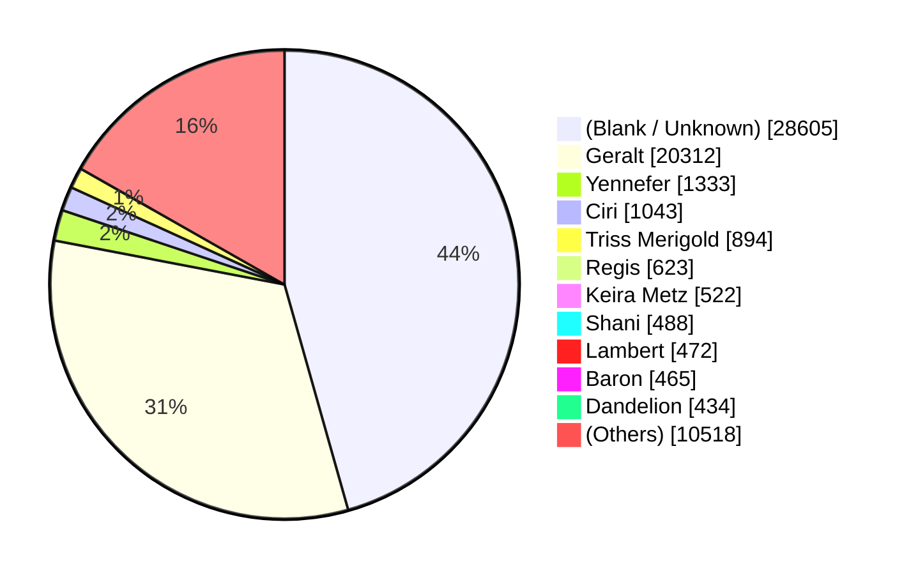

# Witcher 3 Importer Notes

> [!WARNING]
> **HERE BE WYVERNS.** If you're looking for a well-engineered and efficient game dialogue extractor, see [the Skyrim importer](../Serifu.Importer.Skyrim/README.md) instead. I'm hoping to find a better way to pull quotes from CDPR games in the future, but this is what I've got to work with for now. Perhaps it may be useful to someone nonetheless.

1. Download & extract w3utils from https://github.com/JTGizmo/Extracting-Voice-Over-Audio-from-Witcher-3
2. Download & extract vgmstream (Linux ver.) from https://github.com/vgmstream/vgmstream/releases
3. Run extract.sh ([below](#extractsh))

The version of w3unpack.cpp that's provided doesn't seem to output dialogue IDs as seen in w3dialog_id.txt (in the 7z), but luckily the Lua output includes the dialogue line in a comment that's easy to grep out:

```regexp
voicetag = "(?<voicetag>.*)",\r?\n[^}]+? dialogLine = (?<id>0x[0-9a-f]{8}),\s+-- "(?<text>.*)"$
```

https://regex101.com/r/D5ruGU/1

Note:

- Dialogue IDs are unique across bundles.
- Lines containing brackets / curly braces are in other languages and are grepped out. (This also filters out some untranslated lines, probably cut content, that start with "[EN]" in the jp. The importer would remove them anyway though, due to not having Japanese.)
- A few lines contain `<br>` line breaks. This is the only HTML used in dialogue. I'm using sed to fix these occurrences auto-manually.

### TODO

Find a way to identify the correct NPCs for each line. The current approach (using the voicetags that refer to specific NPCs) only covers about half of the dialogue, and I had to manually identify each voicetag and find the appropriate translation as well.



The lua output from w3utils has some actorTags that might be used to identify the NPCs — _if_ we can find NPCs by actor tag, that is. That data might be in the same .w2ent files that contain the character models; search the archive for the path substring "npc_entities".

As for extracting that data, WolvenKit looked promising, but I couldn't get it to convert those files. No doubt the official REDkit can open them, but whether there's a way to automate that for every NPC... In the first place, we need to figure out how exactly the game associates dialogue with an NPC (the actorTags might be a mislead). If we find a solution that uses WolvenKit, it could probably replace w3utils as well. Might even be possible to do it all from C#. Either way, though, it would probably be a major effort.

---

## extract.sh

```bash
#!/bin/bash
#
# Requires:
# - w3utils (https://github.com/JTGizmo/Extracting-Voice-Over-Audio-from-Witcher-3)
# - vgmstream-cli, Linux version (https://github.com/vgmstream/vgmstream/releases)
# - fd (https://github.com/sharkdp/fd)
# - ffmpeg
#
set -eo pipefail

GAME_DIR='/mnt/c/Users/max/Games/The Witcher 3/Game'
OUT_DIR='extracted'
LANGS=(en jp)

declare -A BUNDLES=(
  # Excludes DLC that do not contain dialogue
  [content0]="$GAME_DIR/content/content0"
  [content1]="$GAME_DIR/content/content1"
  [content2]="$GAME_DIR/content/content2"
  [content3]="$GAME_DIR/content/content3"
  [content4]="$GAME_DIR/content/content4"
  [content5]="$GAME_DIR/content/content5"
  [content6]="$GAME_DIR/content/content6"
  [content7]="$GAME_DIR/content/content7"
  [content8]="$GAME_DIR/content/content8"
  [content9]="$GAME_DIR/content/content9"
  [content10]="$GAME_DIR/content/content10"
  [content11]="$GAME_DIR/content/content11"
  [content12]="$GAME_DIR/content/content12"
  [bob]="$GAME_DIR/dlc/bob/content"
  [dlc2]="$GAME_DIR/dlc/dlc2/content"
  [dlc3]="$GAME_DIR/dlc/dlc3/content"
  [dlc7]="$GAME_DIR/dlc/dlc7/content"
  [dlc10]="$GAME_DIR/dlc/dlc10/content"
  [dlc12]="$GAME_DIR/dlc/dlc12/content"
  [dlc15]="$GAME_DIR/dlc/dlc15/content"
  [ep1]="$GAME_DIR/dlc/ep1/content"
)

# Extract dialogue
mkdir -p "$OUT_DIR"

for lang in "${LANGS[@]}"; do
  tsv="$OUT_DIR/$lang.tsv"

  if [[ -f $tsv ]]; then
    echo "$tsv already exists, skipping extracting dialogue"
    continue
  fi

  for bundle in "${!BUNDLES[@]}"; do
    echo "Extracting $bundle $lang dialogue"

    ./w3utils/w3unpack.exe \
      -l "$lang" \
      -c "$(wslpath -w "${BUNDLES[$bundle]}")" \
      "$OUT_DIR/${lang}_${bundle}.lua"
  done

  echo "Building $tsv"

  cat "$OUT_DIR/$lang"_*.lua | ./lua-to-tsv.pl "$lang" > "$tsv"
  rm "$OUT_DIR/$lang"_*.lua
done

# Remove line breaks, fix punctuation
sed -Ei 's/,?<br>/… /g; s/,$/…/g; s/[a-z]$/\0./g' "$OUT_DIR/en.tsv"
sed -Ei 's/、<br>/、/g; s/。<br>/。/g; s/<br>/、/g' "$OUT_DIR/jp.tsv"

# Extract audio
for lang in "${LANGS[@]}"; do
  audio_dir="$OUT_DIR/$lang"

  if [[ -d $audio_dir ]]; then
    echo "$audio_dir already exists, skipping extracting audio"
    continue
  fi

  mkdir -p "$audio_dir"

  for bundle in "${!BUNDLES[@]}"; do
    echo "Extracting $bundle $lang audio"

    ./w3utils/w3unpack.exe -q \
      -u "$(wslpath -w "${BUNDLES[$bundle]}")\\${lang}pc.w3speech" \
      "$audio_dir"
  done
done

# Convert audio
#
# Note: The game audio is already Opus, but it's in a proprietary container that
# apparently only vgmstream can decode, and vgmstream's creator doesn't want to
# support extracting the audio stream without reencoding (with the rather weird
# reasoning that they "encourage preserving original, unmodified data" and
# "avoiding decoding" despite doing the exact opposite)... so we have no choice
# but to do lossy->lossy. Luckily the game audio is a higher bitrate.
# https://github.com/vgmstream/vgmstream/issues/1320
#
# I'm using fd here because it runs jobs in parallel based on the number of CPU
# cores, which is much faster than a for loop.
fd '\.wav$' "$OUT_DIR" -x bash -c '
  echo "Converting {}"
  ./vgmstream-cli -p "{}" | ffmpeg -y -hide_banner -loglevel error \
    -f wav -i pipe: -c:a libopus -b:a 32k -map_metadata -1 "{.}.opus" &&
  rm "{}" "{.}.cr2w"'
```

## lua-to-tsv.pl

```perl
#!/usr/bin/perl

my ($lang) = @ARGV;
if (not defined $lang) {
  die("Usage: lua-to-tsv.pl LANG <lua_file\n");
}

# Voicetags seem to be more like voice types in Skyrim in that the same generic
# voice is used for many NPCs. Unfortunately, I couldn't find a good way to
# resolve the actual NPC for each line of dialogue as I'd done for Skyrim, so
# the best I can do here is give names to the "unique" voicetags: mostly the
# main NPCs and a handful of random ones.
my %voicetags;
open(FH, '<', 'voicetags_unique.tsv') or die $!;
while (<FH>) {
  chomp;
  my @values = split('\t');
  $voicetags{$values[0]} = {
    'en' => $values[1],
    'jp' => $values[2]
  };
}

my $str = do { local $/; <STDIN> };

while ($str =~ /voicetag = "(?<voicetag>.*)",\r?\n[^}]+? dialogLine = (?<id>0x[0-9a-f]{8}),\s+-- "(?<text>.*)"\r?$/gm) {
  my $id = $+{id};
  my $voicetag = $+{voicetag};
  my $text = $+{text};

  if ($text =~ /^0x[0-9a-f]{8}$/) { # Some lines have their ID in place of the text. Not sure why.
    next;
  }

  if ($text =~ /[\[\]{}]/) { # Filter out dialogue in other languages
    next;
  }

  # $voicetag =~ s/(?<=\S)./lc($&)/ge;
  $voicetag =~ s/[\s\d]+$//;

  # $voicetag =~ s/^Becca$/Cerys/;
  # $voicetag =~ s/^Canaris$/Caranthir/;
  # $voicetag =~ s/^Mousesack$/Ermion/;

  # if (not exists $voicetags{$voicetag}) {
  #   die("\"$voicetag\" not found in voicetags.tsv\n");
  # }

  my $key = hex($id);
  my $audioFile = "$id.opus";
  my $name = $voicetags{$voicetag}{$lang};

  print "$key\t$audioFile\t$name\t$text\n";
}
```

## voicetags_unique.tsv

```tsv
ABEL LUPO	Abel Lupo	アベル・ルーポ
AMBASSADOR VAR ATTRE	Ambassador Var Attre	ヴァル・アトレ大使
ANABELLE	Anabelle	アナベル
ANNA HENRIETTA	Anna Henrietta	アンナ・ヘンリエッタ
ARNVALD	Arnvald	アーンヴァルド
AVALLACH	Avallac'h	アヴァラック
BARD DROGODAR	Drogodar	ドロゴダル
BARON	Baron	男爵
BEAU DUVALL	Beau Duvall	ビュー・デュバル
BECCA	Cerys	セリス
BERNARD TULLE	Bernard Tulle	バーナード・テュル
BORYS THE TROLL	Borys The Troll	トロールのボリス
CANARIS	Caranthir	カランシール
CARDUIN	Carduin	カルディン
CELINA	Gran	ばあちゃん
CELINA MONSTER	Gran	ばあちゃん
CIRILLA	Ciri	シリ
CIRILLA YOUNG	Ciri	シリ
COUNT TYBALT	Count Tybalt	ティバルト伯爵
COUNTESS MIGNOLE	Countess Mignole	ミグノール伯爵夫人
CRACH	Crach	クラフ
CYPRIAN WILLEY	Cyprian Wiley	シプリアン・ウィリー
DAMIEN	Damien	ダミエン
DANDELION	Dandelion	ダンディリオン
DETTLAFF	Dettlaff	デトラフ
DETTLAFF MONSTER	Dettlaff	デトラフ
DETTLAFF VAMPIRE	Dettlaff	デトラフ
DIJKSTRA	Dijkstra	ディクストラ
DJINN	Djinn	ジン
DONAR AN HINDAR	Donar An Hindar	ドナール・アン・ヒンダー
DREAMER CORINE TILLY	Corinne Tilly	コリンヌ・ティリー
DRUID YOLAR	Yolar	ヨラー
DUDU BIBERVELDT	Dudu Biberveldt	ドゥードゥー・ビベルヴェルト
DUDU GERALT	Dudu Biberveldt	ドゥードゥー・ビベルヴェルト
DWARF SLEEPY	Gaspard	ギャスパール
EDNA VAR ATTRE	Edna Var Attre	エドナ・ヴァル・アトレ
EIGHT	Harald an Tordarroch	ハラルド・アン・トルダーロク
ELIHAL	Elihal	エリハル
EMHYR	Emhyr var Emreis	エムヒル・ヴァル・エムレイス
EREDIN	Eredin	エレディン
ERNST VAN HOORN	Ernst Van Hoorn	エルンスト・ヴァン・ホルン
ESKEL	Eskel	エスケル
EUNUCH HAPPEN	Happen the Eunuch	召使のハッペン
EUSTACE	Eustace	ユースタス
EWALD BORSODY	Ewald Borsodi	エワルド・ボルソディ
EYVIND	Eyvind	アイヴィン
FELICIA CORI	Felicia Cori	フェリシア・コリ
FERGUS GRAEM	Fergus Graem	ファーガス・グライム
FINNEAS	Finneas	フィネアス
FOLAN	Folan	フォーラン
FRINGILLA VIGO	Fringilla Vigo	フリンギラ・ヴィゴ
FUGAS	Fugas	フガス
GEELS	Ge'els	ゲールズ
GERALT	Geralt	ゲラルト
GODLING JOHNNY	Johnny	ジョニー
GODLING SARA	Sarah	サラ
GRADEN	Graden	グラデン
GRAHAM	Graham	グレアム
GREMISTA	Gremist	グレミスト
GUILLAUME	Guillaume	ギョーム
GUSLAR	The Pellar	祈とう師
HALBJORN	Halbjorn	ハルビョルン
HALLGRIM	Hallgrim	ハルグリム
HANDSOME JACK	Handsome Jacques	ハンサム・ジャック
HATTORI	Hattori	ハットリ
HEMMELFART	Hierarch Hemmelfart	大祭司ヘメルファルト
HJALMAR	Hjalmar	ヤルマール
HJORT	Hjort	ヨルト
HOLGER BLACKHAND	Holger Blackhand	オルガー・ブラックハンド
HORST BORSODY	Horst Borsodi	ホースト・ボルソディ
IDA EMEAN	Ida Emean	アイダ・エミアン
IMLERITH	Imlerith	イムレリス
INKEEPER ELZA	Elsa	エルサ
INNKEEPER GOLDEN STURGEON	Bea	ビー
IRINA RENARDE	Irina Renarde	イリーナ・レナード
IRIS	Iris von Everec	イリス・フォン・エヴェレック
JACOB LUMBERJACK	Woodcutter Jacob	木こりのジェイコブ
JEAN LOUIS LUDOVIC	Jean-Louis Ludovic	ジャン＝ルイ・ルドヴィク
JONAS	Jonas the Innkeep	宿屋の主人のジョナス
JORUND	Jorund	ヨルンド
JULIA	Julia	ジュリア
KAER MORHEN BANDIT	Kaer Morhen Bandit	ケィア・モルヘンの盗賊
KAMERLING	Rafael de Surmann	ラファエル・ド・スルマン
KARL VARESE	Carlo Varese	カルロ・ヴァリーズ
KATAKAN	Katakan	カタカン
KEIRA METZ	Keira Metz	キーラ・メッツ
KING BEGGAR	King of Beggars	物乞いの王
LADY BRAN	Birna	ビルナ
LADY OF THE LAKE	Lady of the Lake	湖の女神
LAMBERT	Lambert	ランバート
LE PAPILLON	Le Papillon	ル・パピヨン
LETHO	Letho	レソ
LIAM	Liam	リアム
LOUIS GHOST	Louis de Corentin	ルイス・ド・コレンティン
LUGOS THE GLAUCOUS	Blueboy Lugos	ブルーボーイ・ルゴス
LUGOS THE MAD	Madman Lugos	マッドマン・ルゴス
LUIZA LA VALETTE	Louisa la Valette	ルイーズ・ラ・ヴァレッテ
LYNX ROCK WITCH	Witch of Lynx Crag	ヤマネコ山の魔女
MARABELLA	Marabella	マーベラ
MARGARITA LAUX ANTILLE	Margarita	マルガリータ
MARGOT GHOST	Margot de Corentin	マーゴット・ド・コレンティン
MARQUISE SERENITY	Marquise Serenity	侯爵夫人
MATHILDA	Matilda	マチルダ
MENGE	Menge	メンジ
MILTON	Milton	ミルトン
MOLLY	Molly	モリー
MOREAU	Professor Moreau	モロー教授
MORKVARG	Morkvarg	モークヴァーグ
MORKVARG WAREWOLF	Morkvarg	モークヴァーグ
MOUSESACK	Ermion	エルミオン
NATHANEL	Nathaniel Pastodi	ナサニエル・パストディ
OLGIERD	Olgierd von Everec	オルギエルド・フォン・エヴェレック
OLIVIER KINGFISHER	Kingfisher	キングフィッシャー
OTRYGG AN HINDAR	Otrygg An Hindar	オトリグ・アン・ヒンダー
PALMERIN	Palmerin	パルメリン
PATRICK HAZELNUTT	Patrick Hazelnutt	パトリック・ヘーゼルナッツ
PHILIPPA EILHART	Philippa Eilhart	フィリパ・エイルハート
PINASTRI	Pinastri	ピナストリ
POPIEL	Popiel	ポピエル
PRISCILLA	Priscilla	プリシラ
RADOVID	Radovid	ラドヴィッド
REGIS	Regis	レジス
REINALD	Reinald	レイナルド
REINALD POSSESSED	Reinald	レイナルド
RICO	Rico	リコ
ROCHE	Vernon Roche	ヴァーノン・ロッシュ
ROSA VAR ATTRE	Rosa Var Attre	ローザ・ヴァル・アトレ
SACHA	Sasha	サシャ
SHANI	Shani	シャニ
SLAVKO ATIMSTEIN	Slavko Atimstein	スラヴコ・アティムシュタイン
STEINGRIM	Steingrim	シュタイングリム
SUKRUS	Sukrus	スクルス
SVANRIGE	Svanrige	スヴァンリッジ
SYANNA	Syanna	シアンナ
TAILOR SJUSTA	Sjusta	スジュスタ
TALAR	Thaler	ザラー
TAMARA	Tamara	タマラ
THEODORE	Theodore	セオドア
TREE GHOST	Daphne's Wraith	ダフネの幽鬼
TRISS	Triss Merigold	トリス・メリゴールド
UDALRYK	Udalryk	ウダルリック
VARIN	Varin	ヴァリン
VERNOSSIEL	Vernossiel	ベルノシエル
VES	Ves	ヴェス
VESEMIR	Vesemir	ヴェセミル
VESPULA	Vespula	ヴェスプラ
VIGI	Vigi	ヴィギ
VIMME VIVALDI	Vimme Vivaldi	ヴィム・ヴィヴァルディ
VIVIENNE	Vivienne	ヴィヴィアン
VON GRATZ	Joachim von Gratz	ヨアキム・フォン・グラッツ
VOORHIS	Morvran Voorhis	モルヴラン・ヴーヒス
WEREWOLF BEREM	Berem	ベレム
WHISTLING WENDY	Whistling Wendy	口笛ウェンディ
WITCH BREWESS	Brewess	ブリュエス
WITCH WEAVESS	Weavess	ウィーヴィス
WITCH WHISPESS	Whispess	ウィスペス
YENNEFER	Yennefer	イェネファー
ZOLTAN CHIVAY	Zoltan Chivay	ゾルタン・シヴェイ
```
