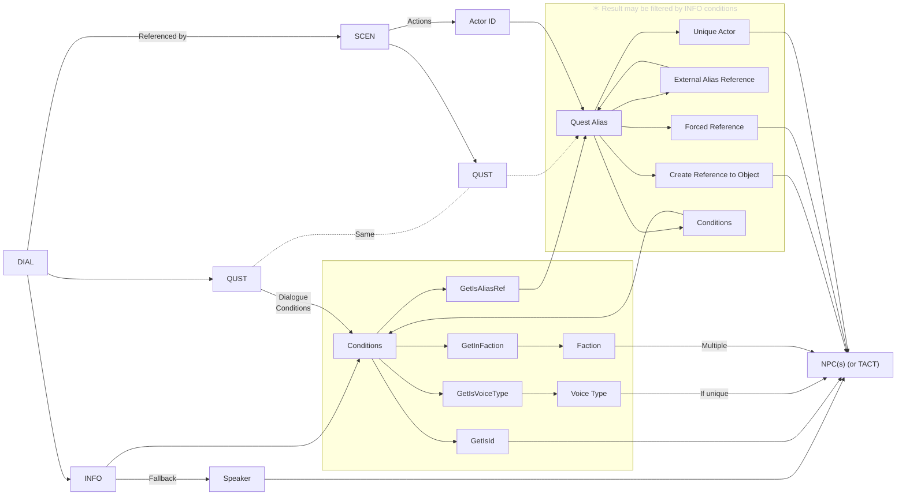

# Skyrim Importer Notes

The most challenging part of this was determining the speaker(s) for a given dialogue. I'm leaving some of my notes here in the hopes that they may be useful to anyone following in my footsteps.

- [Diagram showing the relationship of dialogue to NPCs](#diagram-showing-the-relationship-of-dialogue-to-npcs)
- [Flattening dialog topic infos](#flattening-dialog-topic-infos)
  - [Same INFO record or form ID appearing in multiple DIALs](#same-info-record-or-form-id-appearing-in-multiple-dials)
- [Scene dialogue](#scene-dialogue)
- [Conditions](#conditions)
  - ["Producer" vs. "Filter" Conditions](#producer-vs-filter-conditions)
  - [Condition functions](#condition-functions)
    - [Run On](#run-on)
      - [Run On Reference](#run-on-reference)
    - [Functions](#functions)
- [Factions \& selecting a single NPC](#factions--selecting-a-single-npc)
- [Useful links](#useful-links)

## Diagram showing the relationship of dialogue to NPCs



## Flattening dialog topic infos

If we were to simply iterate over dialogue topics' winning overrides, for any topic that's overridden, we would only see the INFOs that exist in the overriding mod, i.e. the ones it adds and the ones it overrides.

For example, the topic `OfferServicesTopic "What have you got for sale?" [DIAL:0007F6BB]` is overridden by both Dawnguard.esm and Dragonborn.esm, and one of its INFOs is overridden by HearthFires.esm (this is a weird one; explained below), resulting in a mod/record tree (as would be seen in xEdit) like the following (omitting a bunch for brevity):

```diff
 Skyrim.esm
    Dialog Topic
-      0007F6BB   OfferServicesTopic   What have you got for sale?
          0008069D   So you're interested in my potions and ingredients?
-         000A9634   Got a pretty full stock of potions and alchemy reagents.
          000A9635   Ah, so you're an alchemist, then?
          000A9637   Looking to protect yourself, or deal some damage?
          000A963E   Some may call this junk. Me, I call them treasures.
-         0007F6BC   Take a look.
 Dawnguard.esm
    Dialog Topic
-      0007F6BB   OfferServicesTopic   What have you got for sale?
          02003DA9   Got a pretty full stock of potions and alchemy reagents.
 HearthFires.esm
    Dialog Topic
       03003D61   BYOHRelationshipAdoptableUrchins_SofieOfferServicesTopicTopic   What have you got for sale?
+         000A9634   Not much. But I hope you like them!
          03003E64   Some pretty flowers. I picked them all by myself!
 Dragonborn.esm
    Dialog Topic
+      0007F6BB   OfferServicesTopic   What have you got for sale?
+         0007F6BC   Take a look.
          0403689B   I gathered some plants that are useful for making potions, but I have other goods as well.
          0403689C   Among other things, I have some fresh bread I baked this morning and vegetables from Finna's garden.
          0403689D   Mostly things from the village or the land around it. Have a look.
```

The winning override for OfferServicesTopic is in Dragonborn.esm, but as you can see, if we only looked at _its_ INFOs, we'd see just four possible responses: the overridden "Take a look." and the three new ones. In order to get all of those _in addition to_ the regular lines like "Some may call this junk. Me, I call them treasures.", **we need to look at the original definition and all overrides for OfferServicesTopic and find the winning overrides of each INFO in all of them, essentially flattening the dialog topic tree.**

### Same INFO record or form ID appearing in multiple DIALs

The record tree above shows an additional bit of weirdness: it's possible, although rare, for an INFO to appear in multiple DIALs. Presumably this was done to copy an INFO's conditions and so on and not just the responses (which can be linked via Response Data); however, `000A9634`, seen above in both Skyrim.esm and HearthFires.esm under a different topic, is a weird one. At first I thought that Dawnguard had accidentally duplicated the "pretty full stock" line (`02003DA9`) and that they "fixed" it in Hearthfire by repurposing the original line, but `02003DA9`'s conditions will always return false. I searched xEdit for any other INFOs containing "pretty full stock"; aside from RDO adding it as a line that can be spoken when you enter a shop, there was nothing else. Neither USSEP nor RDO fixes the broken Dawnguard INFO or adds back in the original INFO that Hearthfire replaced. Yet, I was confident I'd heard the "pretty full stock" line. Sure enough, when I fired up the game, went to Arcadia's Cauldron, and asked what she had to sell, I did indeed hear it.

Thinking that perhaps xEdit was wrong and that maybe the topic acts as a namespace, I created two mods: one overriding Skyrim.esm's `000A9634` and replacing the text with "TEST", and another overriding HearthFires.esm's `000A9634`, removing the Response Data, and adding a response that says "TEST 2". Then I fired up the game and went to Arcadia's Cauldron: no matter how many times I asked what she had to sell, I never got the line. Next I went to Windhelm and talked to Sofie. After several tries, I got "Not much. But I hope you like them!" but also an unvoiced dialogue with the caption "TEST 2". This would imply that my second mod, overriding the `000A9634` in Hearthfire's SofieOfferServicesTopic, had in fact overridden the `000A9634` in Skyrim's OfferServicesTopic (but Arcadia couldn't speak it as it's conditioned to Sofie) and _added_ it to SofieOfferServicesTopic, as that was the parent topic in the TEST 2 mod. Somehow, that left SofieOfferServicesTopic with **two** INFOs having the same form ID, both of which appeared in game. I have no idea how this can happen, and it seems xEdit doesn't either.

`[INFO:000CD60D]` and `[INFO:000CD610]` are similar; the English text is the same, but the Japanese is translated different, and the Hearthfire versions are conditioned differently. These two are unique in that neither the Skyrim.esm nor HearthFires.esm versions use Response Data, which means there are two INFOs with the same form ID but which need different voice files. Both versions do exist in the Japanese archive:

```
hearthfires.esm
└── maleorc
    └── relationsh_relationshipmar_000cd60d_1.fuz
        今後は二人で世を渡っていくわけだが、どこに住むべきだろう？ どこへでもついて行くが
skyrim.esm
├── femaleorc
│   └── relationsh_relationshipmar_000cd60d_1.fuz
│       俺達はもう一蓮托生だ。どこで暮らす？　俺の故郷はお前の故郷だ
└── maleorc
    └── relationsh_relationshipmar_000cd60d_1.fuz
        俺達はもう一蓮托生だ。どこで暮らす？　俺の故郷はお前の故郷だ
```

But given that 000CD60D belongs to Skyrim.esm, I would expect the top file to never be used (as it would apply to "030CD60D" which doesn't exist, though I'm curious what would happen if it _did_). I've not confirmed what happens in game when this dialogue plays, as it requires marrying a male orc. Does it play the Skyrim.esm audio, resulting in mismatching subtitles?

Considering the weird behavior seen with overriding `000A9634`, I wonder if these only _look_ like overrides of Skyrim.esm in xEdit, but are in fact somehow their own separate records, and only the form IDs are borked. This would make a lot of sense: in both cases, above, I was overriding the Skyrim INFO, not the Hearthfire one, and the form IDs in the voice files always have the mod index as 00 (since that's load order dependent), so even if that's messed up in the record it wouldn't make a difference. I recall that it's possible to define a record in a mod with a form ID belonging to another mod (IIRC some mods do this so that other mods can reference them without adding a hard dependency), so that may be what's happening here; basically a form ID conflict. It's still unclear how the game is able to differentiate them; both xEdit and Mutagen see them as overrides.

I see two solutions:

1. If an INFO's mod index is less than that of its DIAL, replace its ModKey with that of the containing mod. Since an INFO has to be in a DIAL, if the INFO's mod index is 00, then it must exist in a 00 DIAL; if we see it in a 03 DIAL then we know it's one of these weird not-overrides. Luckily, none of the INFO form IDs in the list below exist with a 03 prefix, so they'll just be invalid IDs.
   
2. Rather than change the mod keys, just skip them entirely. Except for the two "PostWedding" lines, all of them, including Sofie's, use Response Data, so those lines will still make it into the final quotes. There are two INFOs that are in Skyrim.esm twice which wouldn't match this condition, but since they link to the same Response Data they'll get deduped. This is better than keeping both and not changing the mod keys (either adding the topic's ID or mod index to the DB key so that both can be inserted, or deduping by form ID and leaving which one wins up to chance), because that would result in those having the wrong audio.
   
In any case, it's crucial that we determine the winning overrides of INFOs ourselves (by looking within the same topic in each mod) rather than let Mutagen do it, as the latter would result in "Got a pretty full stock of potions and alchemy reagents." being replaced with Sofie's "Not much. But I hope you like them!" even in the Skyrim.esm OfferServicesTopic.

<details>
<summary><b>Appendix: All of the places where an INFO exists in multiple DIALs in vanilla</b></summary>

> - [INFO:000A9634] appears in:
>   - OfferServicesTopic "What have you got for sale?" [DIAL:0007F6BB]
>   - BYOHRelationshipAdoptableUrchins_SofieOfferServicesTopicTopic "What have you got for sale?" [DIAL:03003D61]
> - [INFO:000CD60D] appears in:
>   - RelationshipMarriagePostWeddingLoveInterestBlockingTopic "RelationshipMarriagePostWeddingLoveInterestBlockingTopic" [DIAL:0002E118]
>   - RelationshipMarriageCeremonyPostLoveInterestBlockingWithAdoptionTopic [DIAL:03003D71]
> - [INFO:000CD610] appears in:
>   - RelationshipMarriagePostWeddingLoveInterestBlockingTopic "RelationshipMarriagePostWeddingLoveInterestBlockingTopic" [DIAL:0002E118]
>   - RelationshipMarriageCeremonyPostLoveInterestBlockingWithAdoptionTopic [DIAL:03003D71]
> - [INFO:000C57F4] appears in:
>   - RelationshipMarriageWeddingWhiterunHouse "We could live in my house in Whiterun." [DIAL:000C57E0]
>   - RelationshipMarriageWeddingHjaalmarchHouse "We could live in my house in Hjaalmarch." [DIAL:03003D6F]
> - [INFO:000CD595] appears in:
>   - RelationshipMarriageWeddingWhiterunHouse "We could live in my house in Whiterun." [DIAL:000C57E0]
>   - RelationshipMarriageWeddingFalkreathHouse "How about my house in Falkreath?" [DIAL:03003D6E]
> - [INFO:000CD599] appears in:
>   - RelationshipMarriageWeddingWhiterunHouse "We could live in my house in Whiterun." [DIAL:000C57E0]
>   - RelationshipMarriageWeddingFalkreathHouse "How about my house in Falkreath?" [DIAL:03003D6E]
> - [INFO:000CD59A] appears in:
>   - RelationshipMarriageWeddingWhiterunHouse "We could live in my house in Whiterun." [DIAL:000C57E0]
>   - RelationshipMarriageWeddingFalkreathHouse "How about my house in Falkreath?" [DIAL:03003D6E]
> - [INFO:000CD59D] appears in:
>   - RelationshipMarriageWeddingWhiterunHouse "We could live in my house in Whiterun." [DIAL:000C57E0]
>   - RelationshipMarriageWeddingFalkreathHouse "How about my house in Falkreath?" [DIAL:03003D6E]
> - [INFO:000CD59E] appears in:
>   - RelationshipMarriageWeddingWhiterunHouse "We could live in my house in Whiterun." [DIAL:000C57E0]
>   - RelationshipMarriageWeddingFalkreathHouse "How about my house in Falkreath?" [DIAL:03003D6E]
> - [INFO:000CD5A0] appears in:
>   - RelationshipMarriageWeddingWhiterunHouse "We could live in my house in Whiterun." [DIAL:000C57E0]
>   - RelationshipMarriageWeddingHjaalmarchHouse "We could live in my house in Hjaalmarch." [DIAL:03003D6F]
> - [INFO:000C57F2] appears in:
>   - RelationshipMarriageFINWhiterunHouse "Breezehome, my house in Whiterun." [DIAL:000C57E8]
>   - RelationshipMarriageFINFalkreathHouse "Lakeview Manor, my house in Falkreath." [DIAL:03003D6B]
> - [INFO:000CCB58] appears in:
>   - RelationshipMarriageFINWhiterunHouse "Breezehome, my house in Whiterun." [DIAL:000C57E8]
>   - RelationshipMarriageFINFalkreathHouse "Lakeview Manor, my house in Falkreath." [DIAL:03003D6B]
> - [INFO:000CCBA8] appears in:
>   - RelationshipMarriageFINWhiterunHouse "Breezehome, my house in Whiterun." [DIAL:000C57E8]
>   - RelationshipMarriageFINFalkreathHouse "Lakeview Manor, my house in Falkreath." [DIAL:03003D6B]
> - [INFO:000CCBAD] appears in:
>   - RelationshipMarriageFINWhiterunHouse "Breezehome, my house in Whiterun." [DIAL:000C57E8]
>   - RelationshipMarriageFINFalkreathHouse "Lakeview Manor, my house in Falkreath." [DIAL:03003D6B]
> - [INFO:000CCBAE] appears in:
>   - RelationshipMarriageFINWhiterunHouse "Breezehome, my house in Whiterun." [DIAL:000C57E8]
>   - RelationshipMarriageFINFalkreathHouse "Lakeview Manor, my house in Falkreath." [DIAL:03003D6B]
> - [INFO:000CCBAF] appears in:
>   - RelationshipMarriageFINWhiterunHouse "Breezehome, my house in Whiterun." [DIAL:000C57E8]
>   - RelationshipMarriageFINFalkreathHouse "Lakeview Manor, my house in Falkreath." [DIAL:03003D6B]
> - [INFO:000CCBB0] appears in:
>   - RelationshipMarriageFINWhiterunHouse "Breezehome, my house in Whiterun." [DIAL:000C57E8]
>   - RelationshipMarriageFINFalkreathHouse "Lakeview Manor, my house in Falkreath." [DIAL:03003D6B]
> - [INFO:000C6E19] appears in:
>   - DecorateWhiterunBedroom "Bedroom furnishings. (<Global=HDWhiterunBedroom> gold)" [DIAL:000C6E07]
>   - DecorateWhiterunChildBedroom "Children's bedroom. (<Global=HDWhiterunChildRoom> gold)" [DIAL:03003D4C]
> - [INFO:000C6E1A] appears in:
>   - DecorateWhiterunBedroom "Bedroom furnishings. (<Global=HDWhiterunBedroom> gold)" [DIAL:000C6E07]
>   - DecorateWhiterunChildBedroom "Children's bedroom. (<Global=HDWhiterunChildRoom> gold)" [DIAL:03003D4C]
> - [INFO:000C896B] appears in:
>   - DecorateRiftenBedroomTopic "Bedroom furnishings. (<Global=HDRiftenBedroom> gold)" [DIAL:000C8962]
>   - DecorateRiftenChildBedroom "Children's bedroom. (<Global=HDRiftenChildRoom> gold)" [DIAL:03003D4A]
> - [INFO:000C896C] appears in:
>   - DecorateRiftenBedroomTopic "Bedroom furnishings. (<Global=HDRiftenBedroom> gold)" [DIAL:000C8962]
>   - DecorateRiftenChildBedroom "Children's bedroom. (<Global=HDRiftenChildRoom> gold)" [DIAL:03003D4A]
> - [INFO:000E24D8] appears in:
>   - DecorateSolitudeBedroom "Bedroom. (<Global=HDSolitudeBedroom> gold)" [DIAL:000E24D0]
>   - DecorateSolitudeChildBedroom "Children's bedroom. (<Global=HDSolitudeChildRoom> gold)" [DIAL:03003D4B]
> - [INFO:000E24D9] appears in:
>   - DecorateSolitudeBedroom "Bedroom. (<Global=HDSolitudeBedroom> gold)" [DIAL:000E24D0]
>   - DecorateSolitudeChildBedroom "Children's bedroom. (<Global=HDSolitudeChildRoom> gold)" [DIAL:03003D4B]
> - [INFO:000E493D] appears in:
>   - DecorateMarkarthAlchemyLab "Alchemy laboratory. (<Global=HDMarkarthAlchemy> gold)" [DIAL:000E4924]
>   - DecorateMarkarthChildBedroom "Children's bedroom. (<Global=HDMarkarthChildRoom> gold)" [DIAL:03003D49]
> - [INFO:000E67C9] appears in:
>   - DecorateWindhelmArmory "Armory. (<Global=HDWindhelmArmory> gold)" [DIAL:000E67B4]
>   - DecorateWindhelmBedroom "Bedroom furnishings. (<Global=HDWindhelmBedroom> gold)" [DIAL:000E67B9]
> - [INFO:000E67CA] appears in:
>   - DecorateWindhelmArmory "Armory. (<Global=HDWindhelmArmory> gold)" [DIAL:000E67B4]
>   - DecorateWindhelmBedroom "Bedroom furnishings. (<Global=HDWindhelmBedroom> gold)" [DIAL:000E67B9]
> - [INFO:000E67C7] appears in:
>   - DecorateWindhelmBedroom "Bedroom furnishings. (<Global=HDWindhelmBedroom> gold)" [DIAL:000E67B9]
>   - DecorateWindhelmChildBedroom "Children's bedroom. (<Global=HDWindhelmChildRoom> gold)" [DIAL:03003D4D]
> - [INFO:000E67C8] appears in:
>   - DecorateWindhelmBedroom "Bedroom furnishings. (<Global=HDWindhelmBedroom> gold)" [DIAL:000E67B9]
>   - DecorateWindhelmChildBedroom "Children's bedroom. (<Global=HDWindhelmChildRoom> gold)" [DIAL:03003D4D]

</details>

## Scene dialogue

If a topic (DIAL) is referenced by a scene, the scene's corresponding Dialogue action's Actor ID refers to an alias in the associated quest (Actor ID is the same as Reference Alias ID), which the game will "fill" with an NPC (or other reference) via a variety of methods, shown above. Often, a quest alias will explicitly reference a specific NPC, but it may also be filled with e.g. the nearest NPC matching a list of Conditions, which need to be resolved in the same way as the dialogue conditions. This can potentially yield multiple eligible speakers, or unknown (more on Conditions below).
   
Note that each dialogue INFO's conditions are still evaluated for scene dialogue (the line that's spoken might change depending on the player's gender, for instance, or a part of a scene might have multiple lines depending on who's speaking, if the quest alias isn't set to a specific NPC).

When looking for scene actors, we can make the following assumptions (these are not technical restrictions but held true even when run against my full mod list):

  1. If a DIAL's SubtypeName is not SCEN, it won't be referenced by scene actions
  2. The SCEN quest and DIAL quest will always be the same
  3. No DIAL will be referenced by more than one scene action

The quest alias may have a Display Name (ALDN), which overrides the referenced NPC (or TACT)'s name.

## Conditions

### "Producer" vs. "Filter" Conditions

There are four types of conditions for our purposes:

1. Conditions that match specific NPCs: mainly GetIsID, but also potentially GetIsAliasRef and GetIsVoiceType (for unique voice types). These are great because we immediately know who can speak the line.

2. Conditions that generally match a specific group of NPCs, namely GetInFaction. Dialogue that applies to a faction is usually for generic NPCs, like Guards or Bandits, or for a set of specific unique NPCs, like the Companions or residents of a particular town.

   There may be a manually-configured faction override to prioritize a certain names or NPCs. If it's an NPC that's not in the faction by default (e.g. CurrentFollowerFaction), we'll make sure they're included so long as it isn't being used as a negated condition. See the notes on factions & selecting an NPC below for details.

3. Conditions that match a very broad set of NPCs: GetIsVoiceType, GetIsRace, etc.
   
   We could expand these to _all_ matching NPCs, but given how many NPCs share the same voice type (let alone race), this could end up matching the wrong NPC much more easily than GetInFaction. For example, `MS08Stage25GuardBranchTopic [DIAL:000D787E]` includes FemaleNord, so it could technically be spoken by any NPC with that voice type, but because there's also a `GetInCell(WhiterunDragonsreachDungeon)` condition, it will actually only be spoken by the guard down there.

4. Conditions dependent on game state, like the combat target or player location, which we ignore.

The first two types, when not negated, are "producers." Because we can't evaluate all conditions accurately without knowledge of the game state in which the line would be triggered, we have to rely on these and only these to get the initial group of NPCs to which a dialogue might apply. All other conditions (negated GetIsID, non-unique GetIsVoiceType, etc.) can only be used as "filters" to narrow down that initial group.

A set of OR'd conditions can be a "producer" if it contains only producers; their results are concatenated. If any condition in the group can only be used to filter, then the entire group is a "filter," as it can't filter what doesn't exist. However, if there are no "producers" in the ANDs, an OR group containing producers can be used, with the other "filter" conditions in the group ignored (if a dialogue is conditioned to a certain NPC _or_ a certain race, it might not actually be spoken by every NPC in that race, but we at least know that one NPC can say it). When there are multiple "producers" AND'd together, the order doesn't really matter; we just need something to start with.

Ignored conditions (ones that rely on game state) are assumed to return True; therefore any OR group that contains ignored conditions is itself ignored.

If there are no "producers" amongst the conditions, such as in the `MS08Stage25GuardBranchTopic` example, then we have to return null, as there's no way to reliably determine the speaker in that case. It's still possible to attribute a quote to the wrong NPC even with this logic, though. For example, for a dialogue that applies to the entire Dark Brotherhood faction, but at its stage in the quest only Astrid is around, we might mistakenly choose Babette instead. This should hopefully be rare (and further filtering the result set to NPCs who actually have a sound file for their voice type should help to avoid such cases).

### Condition functions

#### Run On

**tl;dr - It seems like we can ignore anything that isn't Subject.**

Quoting the [Creation Kit wiki](https://ck.uesp.net/wiki/Category:Conditions#Run_On):

> - **Subject:** The actor owning the object. In the case of dialogue, it's whoever is saying it. In the case of quest targets, it's the player. In the case of Magic Effects and other Effect Items, it is the reference being targeted by the effect.
> - **Target:** For dialogue, this is the actor being spoken to. For Packages, it's the actor/object specified as the target. Magic Effects and Effect Items, it is the reference being targeted by the effect.
> - **Reference:** A specific reference in the world. Use the Select button to find the reference.
> - **Combat Target:** If the owning actor is in combat, it is his current combat target. For Magic Effects and Effect Items, it is the reference being targeted by the effect.
> - **Linked Reference:** If the reference is linked to another reference, the condition function will be run on the linked object.
> - **Quest Alias:** If the condition is being applied to something that is owned by a quest (dialogue in a quest, an alias in a quest, or a package whose "owning quest" is set to a particular quest) then you can select to run a condition on a reference alias belonging to that quest.
> - **Package Data:** you can point to package data that is a reference and run the condition function on that, however, this only works for conditions applied to packages, procedures, and procedure tree branches.
> - **Event Data:** points to references in particular radiant quest event data (for example Actor1 in an ActorDialogue event), like 'Run on Quest Alias' this only works for things owned by a quest of that type.

Target and Combat Target are irrelevant here. See below for Reference. Linked Reference is only being used for GetDead, and Package Data only for GetDisabled. There are a few using Event Data but not related to the speaker.

Besides Subject, that leaves Quest Alias. I didn't check all of them, but this seems to be used in a similar manner as Reference, just with a dynamic reference instead.

The "SwapSubjectAndTarget" flag would suggest that it makes the Target the Subject and vice versa, but I'm not actually sure that's what it does, because it's mainly used for magic effects to refer to the caster rather than who's being hit by the spell, but the above says both Subject _and_ Target normally refer to the latter. Regardless, the only dialogue conditions that have this flag set are GetInContainer, GetGlobalValue, GetStage, and GetShouldAttack, and it may have been set by mistake because the first one runs on neither Subject nor Target but Quest Alias, the next two ignore the Run On, and the last one has a null reference. Anyway, safe to ignore this flag for dialogue.

##### Run On Reference

Conditions that run on a Reference seem to be mainly for checking the state of things, e.g. is an NPC dead or not, is a door locked, etc. Of particular note are a handful of dialogues that have Reference.GetInFaction and Reference.GetIsAliasRef:

- `DialogueWhiterunUlfberthTopicsBranch2Topic "Who's in charge of Whiterun?" [DIAL:000C368A]` uses this to check who's the current Jarl of Whiterun.
- `DLC1VQ02TolanMeetsSeranaTopic1 [DIAL:02010386]` enables a dialogue option with Tolan if Serana is currently your follower.
- `DLC1RadiantLookingForWorkTopic "What can I do to help?" [DIAL:020050A7]` will direct you to one of several NPCs depending on which of them is in a faction marking them as your next questgiver.
- `RelationshipAdoption_Hellos [DIAL:03003CFF]` is a bit weird. It has a bunch of lines that can be spoken by one of your adopted children, but a line like "Lars is such a milk-drinker" needs to not be spoken by Lars himself. Rather than check if the Subject is in a faction and not a particular ID, like most dialogue does, this one checks if the Subject is one of the adoption quest's "child" aliases and then checks that _the quest alias_ is not Lars.
- Hearthfire modifies the "Battle-Born! Give me your money!" scene between Braith and Lars (`[INFO:00092A62]` etc.) to apparently prevent it from happening if Braith is adoptable, which I think would require somehow killing her parents right at the start of the game before you even entire Whiterun?

There are also a ton that reference `PlayerRef [PLYR:00000014]` to check various things about the player. (Note: This ref can't be resolved by Mutagen, as it's one of the few things defined not in the masters but the exe itself.) Aside from `RelationshipAdoption_Hellos`, which we could special-case to figure out the correct NPCs for each line, all Reference conditions can be ignored.

#### Functions

After going through all of the Subject condition functions used in INFO conditions, quest dialogue conditions, and alias conditions (for aliases used in scenes), these appear to be the ones we can use which don't rely on game state:

| Function         | Producer? | Function         | Producer? |
| ---------------- | --------- | ---------------- | --------- |
| [GetInFaction]   | Yes       | [GetIsRace]      | No        |
| [GetIsAliasRef]  | Yes       | [GetIsSex]       | No        |
| [GetIsID]        | Yes       | [IsChild]        | No        |
| [IsInList]       | Yes       | [IsGuard]        | No        |
| [GetIsVoiceType] | If unique |                  |           |

("Producers" are ones that refer to specific NPCs. Refer to _"Producer" vs. "Filter" Conditions_ above for an explanation of why that's important.)

[GetInFaction]: https://ck.uesp.net/wiki/GetInFaction
[GetIsAliasRef]: https://ck.uesp.net/wiki/GetIsAliasRef
[GetIsID]: https://ck.uesp.net/wiki/GetIsID
[GetIsRace]: https://ck.uesp.net/wiki/GetIsRace
[GetIsSex]: https://ck.uesp.net/wiki/GetIsSex
[GetIsVoiceType]: https://ck.uesp.net/wiki/GetIsVoiceType
[IsChild]: https://ck.uesp.net/wiki/IsChild
[IsGuard]: https://ck.uesp.net/wiki/Talk:IsGuard
[IsInList]: https://ck.uesp.net/wiki/IsInList

## Factions & selecting a single NPC

Once we have a group of possible NPCs (or TACT) to which to attribute the dialogue:

1. Find all of the voice types for which audio exists for the dialogue and filter the results to NPCs who have those voice types. Also make sure they all have translated names. This should help to eliminate any NPCs we included but shouldn't have.

2. Due to the Civil War questline replacing the guards in cities with soldiers and the large number of generic solider NPCs, a lot of guard dialogue may end up attributed to "Imperial Soldier" or "Stormcloak Soldier" rather than the appropriate "Whiterun Guard" etc. if we apply the logic in step 3. After making a spreadsheet of faction NPCs and dialogue, I've decided the best way to handle this is by a set of manually-configured "faction overrides":

   For each non-negated GetInFaction used in the conditions, if there's an override, the result is filtered to the specific NPC (if a FormKey) or NPCs (by name) if they exist in the result set.

   This also lets us make Lydia and Ysolda the speaker for all follower and marriage dialogue, respectively (just because), and attribute the CWBuddies dialogue to Hadvar, as though the player had chosen to side with the Imperials, which is of course the best choice. As mentioned above, if the override is specified by FormKey and the faction doesn't include that NPC by default (would be added dynamically during the game), a non-negated GetInFaction should include the overridden NPC so that they're available at this point (unless excluded by other conditions).

   This is likely better than a general list of prioritized NPCs, as that would end up with guards and Lydia being chosen for _any_ dialogue for which they're eligible, not just guard and follower dialogue, essentially dominating the list of quotes.

   I've done a similar thing for voice types, prioritizing the unique guard and bandit voices for their respective faction.s

3. _(If no faction overrides are applied)_ To deal with generic NPC factions, which can contain a huge number of NPCs for different levels: if the majority of the results are generic NPCs, rather than have quotes attributed to "Bandit Marauder", "Bandit Outlaw" and so on at random, find the name that appears most often in the group ("Bandit") and filter to NPCs with that name (differing at that point only by voice type). Note that many generic NPC factions also contain some unique NPCs, and vice versa.

4. Finally, group by NPC name and choose randomly from those groups, then randomly from within, using a Random seeded with the INFO's form ID (to avoid changing a bunch when re-running the program). They might all have the same name at this point if step 3 happened, but if not, it might be like JobMerchantFaction, which is 85% unique NPCs but the rest are all "Hunter".

## Useful links

- https://mutagen-modding.github.io/Mutagen/
- https://en.uesp.net/wiki/Skyrim_Mod:Mod_File_Format/DIAL
- https://en.uesp.net/wiki/Skyrim_Mod:Mod_File_Format/INFO
- https://en.uesp.net/wiki/Skyrim_Mod:Mod_File_Format/QUST#Aliases
